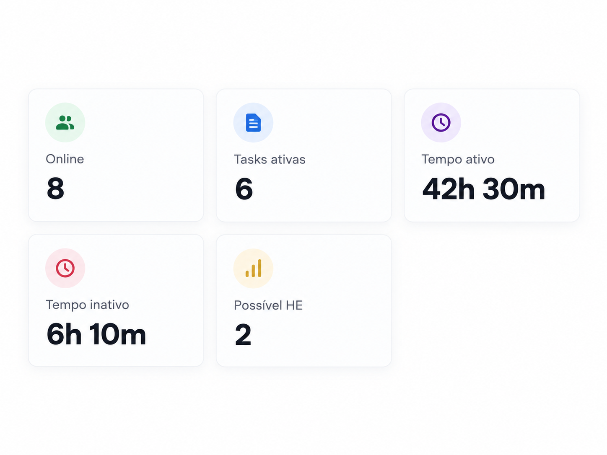
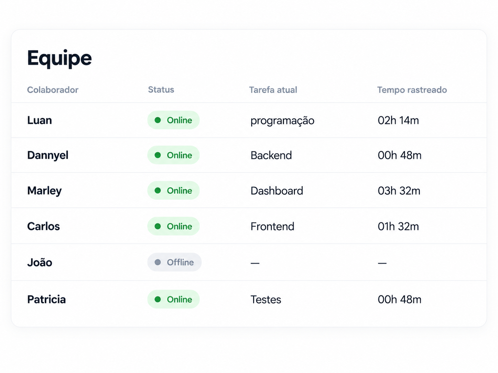
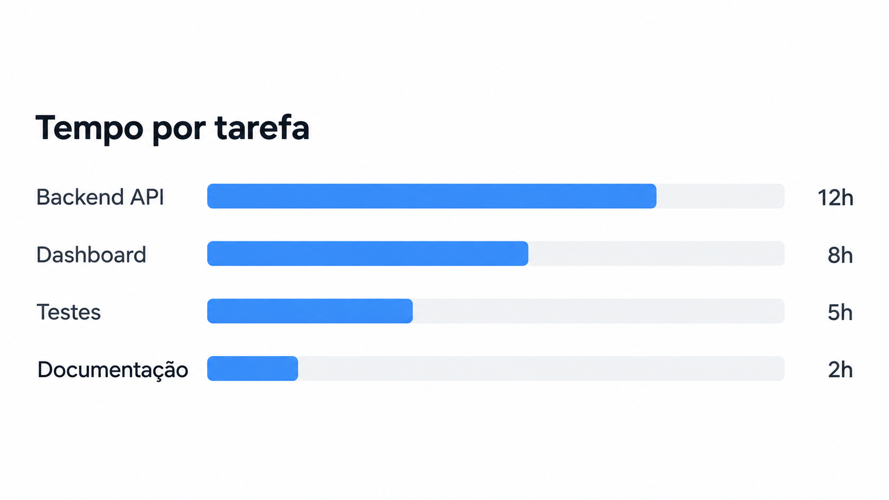
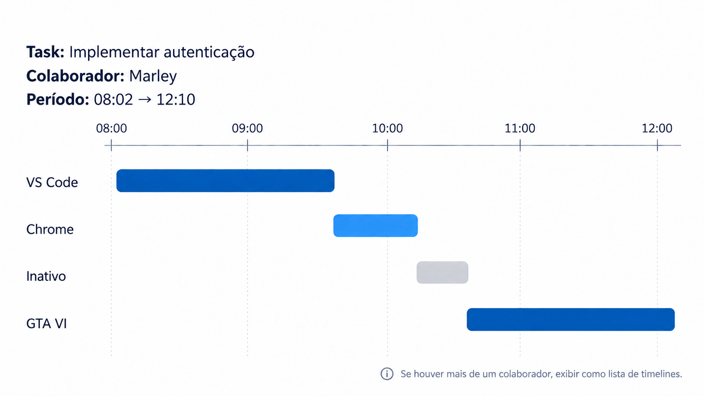

# screen — Dashboard

## Objetivo

Apresentar ao gestor uma visão geral da equipe, das tasks em andamento, das atividades registradas e da jornada dos colaboradores.

## Quem acessa

- Gestor.

---


No topo da tela devem estar disponíveis os filtros utilizados para atualizar as informações do Dashboard.

### Filtros

- período: intervalo de tempo a ser analisado, por exemplo `12/09/2026 até 12/10/2026`;
- colaborador;
- task.

Exemplo:

```text
Dashboard

[ Período ▼ ] [ Colaborador ▼ ] [ Task ▼ ] 
```

Ao alterar um filtro, os indicadores e visualizações da tela devem ser atualizados de acordo com a seleção.

---

## 2. Cards de resumo

Logo abaixo dos filtros devem ser exibidos cards com os principais indicadores do período selecionado.

### Cards

- colaboradores online;
- colaboradores offline;
- tasks ativas;
- tempo total ativo;
- tempo total inativo;
- possíveis horas extras.

Exemplo:



---

## 3. Status da equipe

Apresentar uma visão resumida dos colaboradores associados ao gestor.

Para cada colaborador poderão ser exibidos:

- nome;
- status Online/Offline;
- task ativa, quando existir;
- horário de início da task;
- tempo registrado na task atual.

Exemplo:



O gestor poderá selecionar um colaborador para acessar seus detalhes.

---

## 4. Tempo por task

Apresentar quanto tempo foi registrado em cada task dentro do período selecionado.

A visualização pode utilizar um gráfico de barras.

Exemplo:



O objetivo é permitir comparar a distribuição do tempo registrado entre as diferentes tasks.

---


## 5. Activity Timeline

Permitir visualizar detalhadamente a sequência das atividades registradas durante uma task para cada colaborador selecionado.



Exemplo:

A timeline deve permitir identificar:

aplicação monitorada;
início do período;
término do período;
duração;
estado Ativo/Inativo;
task relacionada.

O gestor deve poder selecionar o colaborador cuja Activity Timeline deseja visualizar.

Caso o resultado inclua mais de um colaborador, a visualização deverá ser apresentada como uma lista de timelines, com uma timeline para cada colaborador.

Exemplo:

```text
VS Code

Início: 08:02
Fim: 09:37
Duração: 1h35
Estado: Ativo
Task: Implementar autenticação
```

---

## 6. Exportar relatório

Permitir ao gestor gerar um relatório com base nas informações apresentadas no Dashboard.

### Formatos disponíveis

- CSV;
- PDF.

### Conteúdo do relatório

O relatório deve considerar os filtros aplicados e poderá incluir:

- cards e indicadores do Dashboard;
- status dos colaboradores;
- tempo registrado por task;
- jornada planejada × realizada;
- possíveis horas extras;
- Activity Timeline dos colaboradores incluídos no filtro.

No caso do PDF, as visualizações gráficas devem ser apresentadas no relatório.

No caso do CSV, as informações devem ser exportadas em formato tabular compatível com os dados apresentados nas visualizações.

### Regras

- exportar somente informações que o gestor possui permissão para visualizar;
- considerar os filtros ativos no momento da exportação;
- incluir somente colaboradores e tasks pertencentes ao resultado filtrado;
- possíveis horas extras devem continuar identificadas como indicação;
- o relatório não deve apresentar métricas ou rankings de produtividade.

---

## 7. Ações disponíveis

A partir do Dashboard, o gestor poderá:

- aplicar filtros;
- acessar um colaborador;
- acessar uma task;
- consultar o tempo registrado;
- consultar a jornada;
- visualizar a Activity Timeline;
- selecionar o colaborador da Activity Timeline;
- exportar relatório em CSV;
- exportar relatório em PDF.

---

## 8. Regras gerais

- mostrar somente colaboradores associados ao gestor;
- considerar Online colaborador com login no sistema;
- mostrar somente informações pertencentes às tasks e colaboradores que o gestor pode acessar;
- períodos de inatividade devem ser apresentados separadamente dos períodos de atividade;
- os filtros devem atualizar os indicadores e visualizações relacionados;
- não apresentar métricas ou rankings de produtividade;
- atividade registrada não deve ser interpretada automaticamente como produtividade;
- possíveis horas extras devem ser apresentadas como indicação, e não como confirmação definitiva de hora extra.

---

## 9. Requisitos relacionados

- RN-19
- RF-27
- CA-10


