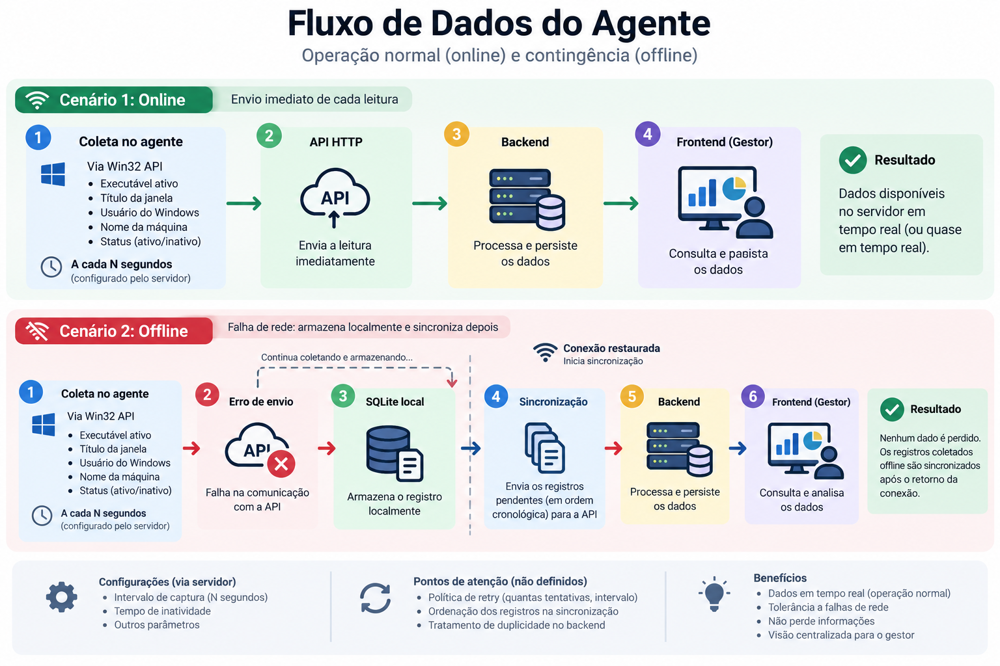

# Time Tracker — Documento de Requisitos

**Responsáveis:** Marley Eduardo Rocha Guedes, Patricia Pereira Martins – Time de Requisitos e Testes
**Data:** Setembro de 2026
**Versão:** 1.0.0
**Status:** Rascunho
**Audiência:** Equipe de desenvolvimento e gestores do sistema

## Sumário

1. [Introdução](#1-introdução)

2. [Visão do Produto](#2-visão-do-produto)

3. [Escopo](#3-escopo)

4. [Personas](#4-personas)

5. [Fluxos Principais](#5-fluxos-principais)

6. [Regras de Negócio](#6-regras-de-negócio)

7. [Requisitos Funcionais](#7-requisitos-funcionais)

8. [Requisitos Não Funcionais](#8-requisitos-não-funcionais)

9. [Regras de Interface](#9-regras-de-interface)

10. [Requisitos Condicionantes](#10-requisitos-condicionantes)

11. [Considerações de Arquitetura](#11-considerações-de-arquitetura)

12. [Critérios de Aceite](#12-critérios-de-aceite)

## 1. Introdução

Este documento especifica o projeto Time Tracker: agente desktop, backend/API e dashboard web. Ele orienta a implementação e a validação das capacidades descritas no PDF inicial.

## 2. Visão do Produto

### 2.1 O que é o Time Tracker

O Time Tracker é uma solução open source corporativa para monitoramento automatizado de atividades em estações de trabalho.

O agente coleta, ****de forma não intrusiva****:

- o nome do processo

- título da janela ativa

- screenshot da janela ativa

**ideia fazer um OCR, para identificar se tem alguma informação sensível do usuário antes de enviar**

#### SQLite

- O banco de dados SQLite entra quando houver uma falha na requisição da API.

#### Backend

- Organiza os dados

- Realiza análises estatísticas

#### Dashboard

- Permite a análise de produtividade pelos gestores.

### 2.2 Problema que Resolve

| Problema | Impacto informado ou objetivo da solução |
| --- | --- |
| Falta de uma visão centralizada das atividades realizadas nas estações de trabalho. | O projeto pretende consolidar dados em uma plataforma web para análise de produtividade. |
| Necessidade de identificar atividade, inatividade e distribuição de tempo por categoria. | Gestores precisam visualizar colaboradores ativos, aplicações em uso e relatórios de produtividade. |
| Falhas de rede podem impedir o envio dos registros. | O agente precisa manter os registros pendentes e sincronizá-los quando a conexão voltar. |

### 2.3 Proposta de Valor

- **Para o gestor:** visualizar atividade em tempo real, configurar o agente, acompanhar métricas e exportar relatórios.

- **Para o colaborador:** ter o período de atividade monitorado sem captura de teclas, microfone ou câmera e com ícone visível na System Tray.

- **Para a equipe de desenvolvimento:** contar com uma solução open source, documentada e inicializável por Docker Compose.

## 3. Escopo

### 3.1 O que está no Escopo

**Versão ou entrega contemplada:** MVP 1.0.0.

| # | Funcionalidade |
| --- | --- |
| 1 | Agente Windows 10/11 x64 em C#/.NET 8, com captura da janela ativa via Win32 API. |
| 2 | Detecção configurável de inatividade do mouse e teclado. |
| 3 | Envio dos registros ao backend/servidor e contingência em SQLite local quando a rede falhar. |
| 4 | Identificação automática do usuário Windows e do hostname. |
| 5 | Configuração remota do intervalo de captura e do tempo de inatividade. |
| 6 | API FastAPI com PostgreSQL, categorização por palavras-chave e documentação OpenAPI em `/docs`. |
| 7 | Dashboard React/Vite/Tailwind com visão em tempo real, KPIs, distribuição por categoria, timeline, relatórios e exportação CSV/PDF. |
| 8 | Gestão de palavras-chave de categorização pelo gestor. |

**Limites ou exclusões confirmadas:** não capturar teclas digitadas; não acessar microfone ou câmera; coletar somente nome do processo, screenshot, atividade de mouse e teclado e título da janela; uso em máquinas corporativas. Funcionalidades fora dessa lista não estão determinadas pelo PDF.

## 4. Personas

### 4.1 Gestor

**Descrição:** pessoa que utiliza o painel web para acompanhar colaboradores e configurar o sistema.

**Objetivos:**

- Acompanhar quais colaboradores estão online e qual aplicação ou janela está em uso.

- Consultar métricas e relatórios de produtividade.

- Configurar intervalo de captura, tempo de inatividade e palavras-chave.

**Necessidades:**

- Acesso ao dashboard e aos endpoints correspondentes.

- Visualização de dados agregados e por colaborador.

### 4.2 Colaborador

**Descrição:** pessoa que utiliza uma estação Windows corporativa com o agente desktop instalado.

**Objetivos:** ter suas atividades da estação registradas e identificadas pelo sistema.

**Necessidades:** agente em execução com ícone visível na System Tray e comunicação com o servidor.

## 5. Fluxos Principais

### 5.1 Capturar e enviar atividade

**Participantes:** Agente desktop, servidor/backend e colaborador.

**Condição inicial:** agente instalado e configuração de captura disponível.

**Gatilho:** chegada do intervalo configurado.

| Etapa | Quem executa | Ação ou resposta esperada |
| --- | --- | --- |
| 1 | Agente | Lê via Win32 API o nome do processo e o título da janela em primeiro plano, e faz uma screenshot.|
| 2 | Agente | Obtém usuário Windows, hostname e estado de atividade/inatividade. |
| 3 | Agente | Envia o registro ao servidor. |
| 4 | Backend | Recebe, classifica por palavras-chave e disponibiliza o dado ao dashboard. |

**Resultado final:** registro disponível para consultas analíticas.



**Alternativas e falhas:** se a rede falhar, armazenar o registro em SQLite local e sincronizá-lo quando a conexão for restabelecida. O comportamento de confirmação, retry e duplicidade não foi definido.

### 5.2 Consultar o dashboard

**Participantes:** Gestor, dashboard web e API backend.

**Condição inicial:** API e dashboard disponíveis.

**Gatilho:** gestor acessa o painel ou solicita uma consulta.

| Etapa | Quem executa | Ação ou resposta esperada |
| --- | --- | --- |
| 1 | Gestor | Acessa o dashboard e informa, quando aplicável, a data ou colaborador. |
| 2 | Dashboard | Consulta a API de visão em tempo real ou sumário diário. |
| 3 | API | Retorna atividade, categorias, duração e dados de colaboradores conforme o endpoint. |
| 4 | Dashboard | Exibe KPIs, gráfico de rosca, tabela em tempo real, timeline e relatório. |

**Resultado final:** gestor visualiza as métricas solicitadas.

**Alternativas e falhas:** tratamento de API indisponível, carregamento, vazio e erro não foi especificado ainda.

### 5.3 Configurar o sistema

**Participantes:** Gestor, dashboard, API e agente desktop.

**Condição inicial:** gestor possui acesso ao painel; demais permissões não foram definidas.

**Gatilho:** gestor consulta ou atualiza configurações (somente no início da sessão).

| Etapa | Quem executa | Ação ou resposta esperada |
| --- | --- | --- |
| 1 | Gestor | Consulta ou altera intervalo de captura, tempo de inatividade ou regras de categorização. |
| 2 | API | Persiste e disponibiliza a configuração no servidor. |
| 3 | Agente | Consulta periodicamente as configurações e aplica-as em tempo de execução. |

**Resultado final:** agente utiliza as configurações definidas.

**Alternativas e falhas:** autenticação, validação dos valores, frequência de consulta e comportamento quando a configuração estiver indisponível não foram definidos.

## 6. Regras de Negócio

### RN-01 — Dados coletados e Privacidade da coleta

O sistema deve restringir a coleta a:

- nome do processo;
- screenshot da tela, sem informações sensíveis;
- estado de atividade/inatividade com base na interação de mouse e teclado;
- título da janela;
- identificadores automáticos de usuário Windows e hostname necessários aos registros.

**Exceções:** nenhuma exceção de coleta foi informada.

### RN-02 — Inatividade

Quando a ausência de interação de mouse e teclado ultrapassar o tempo configurado, padrão de 5 minutos, o período deve ser marcado como inativo.

**Exceções:** não define exceções.

### RN-03 — Categorização

Os registros devem ser classificados nas categorias Desenvolvimento, Design, Comunicação, Social e Outros por palavras-chave configuradas, considerando processo, título ou ambos conforme a regra.

**Exceções:** prioridade entre regras conflitantes não definida.

### RN-04 — Lógica de envio dos dados

Quando a conexão com o servidor falhar, os registros devem ser armazenados em SQLite local e sincronizados quando a conexão for restabelecida; após a sincronização, devem ser removidos do buffer local.

**Exceções:** política de retry, ordenação e duplicidade não definida.

## 7. Requisitos Funcionais

### Módulo: Agente desktop

| ID | Requisito | Prioridade |
| --- | --- | --- |
| RF-01 | O agente deve capturar, via Win32 API, o nome do executável e o título da janela ativa e capturar nome do usuário do Windows e nome da máquina. | Alta |
| RF-02 | O agente deve enviar cada leitura ao servidor imediatamente e sem acúmulo local durante a operação normal. | Alta |
| RF-03 | O agente deve marcar o período como inativo quando o tempo sem interação de mouse ou teclado ultrapassar o limite configurado. | Alta |
| RF-04 | O agente deve armazenar registros em SQLite quando houver falha de rede e sincronizá-los ao restabelecer a conexão. | Alta |
| RF-05 | O agente deve consultar e aplicar em tempo de execução o intervalo de captura e o tempo de inatividade configurados no servidor. | Alta |
| RF-06 | O agente deve exibir na System Tray o status da conexão Online ou Offline. | Alta |

### Módulo: Backend e API

| ID | Requisito | Prioridade |
| --- | --- | --- |
| RF-08 | A API deve classificar registros nas categorias Desenvolvimento, Design, Comunicação, Social e Outros por palavras-chave configuradas. | Alta |
| RF-09 | A API deve permitir ao gestor criar e editar palavras-chave de classificação. | Média |
| RF-10 | A API deve fornecer visão em tempo real com última atividade de cada colaborador ativo nos últimos minutos, incluindo aplicativo, janela, categoria e tempo desde a última atividade. | Alta |
| RF-11 | A API deve fornecer sumário diário com total de horas e distribuição por categoria, filtrável por data e colaborador. | Alta |
| RF-12 | A API deve disponibilizar consulta e atualização das configurações de intervalo de captura, tempo de inatividade e regras de categorização. | Alta |
| RF-13 | A API deve disponibilizar documentação OpenAPI/Swagger em `/docs`. | Alta |

### Módulo: Dashboard web

| ID | Requisito | Prioridade |
| --- | --- | --- |
| RF-14 | O dashboard deve exibir quais colaboradores estão online e qual aplicativo ou janela está em uso. | Alta |
| RF-15 | O dashboard deve exibir distribuição de tempo por categoria e total de horas por colaborador. | Alta |
| RF-16 | O dashboard deve permitir exportar dados em CSV e PDF. | Média |

## 8. Requisitos Não Funcionais

### 8.1 Plataforma e compatibilidade

| ID | Requisito |
| --- | --- |
| RNF-01 | O agente desktop deve executar em Windows 10 e Windows 11, arquitetura x64. |

### 8.2 Desempenho

| ID | Requisito |
| --- | --- |
| RNF-02 | O agente deve consumir menos de 50 MB de RAM e 1% de CPU, conforme método de medição ainda não definido. |

### 8.3 Segurança e privacidade

| ID | Requisito |
| --- | --- |
| RNF-03 | A comunicação do sistema deve ocorrer exclusivamente via HTTPS. |
| RNF-04 | O sistema não deve capturar teclas digitadas nem acessar microfone ou câmera; o ícone do agente deve permanecer visível na System Tray. |
| RNF-05 | A coleta deve respeitar os limites definidos na RN-01 e ocorrer exclusivamente em máquinas corporativas. |

### 8.4 Documentação e implantação

| ID | Requisito |
| --- | --- |
| RNF-06 | A infraestrutura deve ser inicializável com `docker compose up`. |
| RNF-07 | A documentação da API deve seguir o padrão OpenAPI/Swagger definido no RF-13. |

### 8.5 Outros atributos

Escalabilidade, disponibilidade, acessibilidade, retenção e descarte de dados, autenticação, autorização detalhada, navegadores suportados e metas de recuperação não são determinados pelo PDF.

## 9. Regras de Interface

### 9.1 Dashboard web

- **Acesso:** gestor, conforme perfil citado no PDF; autenticação e autorização não especificadas.

- **Elementos:** seletor de data, indicador de status da API, cards de horas monitoradas, colaboradores ativos e software mais usado, gráfico de rosca, tabela em tempo real, timeline e exportação CSV/PDF.

- **Validação:** não definida.

- **Carregamento:** não definido.

- **Sucesso:** apresentar dados retornados pela API.

- **Erro:** não definido.

- **Estado vazio:** não definido.

- **Restrições de interação:** ações de configuração e exportação são associadas ao gestor, mas a matriz detalhada não foi definida.

- **Referências:** RF-10 a RF-16.

### 9.2 Agente na System Tray

- **Acesso:** colaborador da estação Windows.

- **Elementos:** ícone visível e menu de contexto com status Online ou Offline.

- **Validação, carregamento, sucesso, erro e estado vazio:** Não se aplica ou não determinado pelo PDF.

- **Referências:** RF-06, RN-01.

### 9.3 Experiência geral

- **Navegação:** dashboard como SPA React; rotas não especificadas.

- **Mensagens:** não definidas.

- **Adaptação de tela:** a interface é web, mas breakpoints e comportamentos responsivos não são especificados no PDF.

- **Acessibilidade:** não definida.

- **Confirmações:** não definidas.

## 10. Requisitos Condicionantes

| ID    | Condicionante                                                  | Impacto                                                         |
| ----- | -------------------------------------------------------------- | --------------------------------------------------------------- |
| RC-01 | Agente em C#/.NET 8 com integração Win32 e SQLite.             | Restringe a plataforma e as tecnologias utilizadas pelo agente. |
| RC-02 | Backend em Python/FastAPI com PostgreSQL e Swagger em `/docs`. | Condiciona a implementação da API, persistência e documentação. |
| RC-03 | Dashboard em React/Vite/Tailwind CSS com Recharts.             | Condiciona a implementação da interface e dos gráficos.         |
| RC-04 | Infraestrutura inicializável por Docker Compose.               | Condiciona a forma de implantação inicial.                      |
| RC-05 | Agente compatível com Windows 10/11 x64.                       | Exclui outras plataformas do escopo do MVP.                     |
| RC-06 | Comunicação exclusivamente via HTTPS.                          | Exige comunicação segura entre agente, API e dashboard.         |

## 11. Considerações de Arquitetura

### Fluxo normal

Durante a operação normal, cada leitura coletada pelo agente será enviada diretamente à API, sem acúmulo local.

```text

Agente → HTTPS → API → PostgreSQL

```

O SQLite não participa do fluxo normal de persistência.

### Contingência de rede

Caso a comunicação com a API falhe, as leituras serão armazenadas localmente em SQLite.

```text

Agente → tentativa de envio → falha

                           ↓

                        SQLite

```

Quando a conexão for restabelecida, os registros pendentes deverão ser sincronizados com o backend.

```text

SQLite → API → PostgreSQL

```

### Responsabilidades dos componentes

| Componente    | Responsabilidade                                                                                                            |
| ------------- | --------------------------------------------------------------------------------------------------------------------------- |
| Agente        | Coletar informações da máquina e da janela ativa, detectar inatividade, enviar leituras e controlar a contingência offline. |
| SQLite        | Armazenar temporariamente leituras que não puderam ser enviadas ao servidor.                                                |
| API / Backend | Receber, validar, processar e persistir os dados enviados pelos agentes.                                                    |
| PostgreSQL    | Manter os dados centralizados e persistentes do sistema.                                                                    |
| Dashboard     | Consultar a API e apresentar métricas, gráficos e informações ao gestor.                                                    |

### Pontos em aberto

Ainda precisam ser definidos:

* autenticação e autorização;

* contrato de comunicação entre agente e API;

* formato exato dos dados enviados;

* política de retry;

* idempotência e tratamento de duplicidades;

* ordenação dos registros durante a sincronização offline;

* política de retenção dos dados;

* navegadores suportados;

* breakpoints da interface;

* método de medição de desempenho.

## 12. Critérios de Aceite

### CA-01 — Captura da janela ativa

**Requisitos relacionados:** RF-01, RNF-01.

- **Dado que:** o agente está em execução em Windows 10/11 x64.

- **Quando:** chega o intervalo de captura.

- **Então:** o agente registra o nome do executável, título da janela, screenshot da tela, usuário Windows e hostname.

- [ ] Critério verificado e atendido.

**Evidência:**

### CA-02 — Inatividade

**Requisitos relacionados:** RF-03, RN-02.

- **Dado que:** o tempo sem interação de mouse e teclado ultrapassa o limite configurado.

- **Quando:** o agente verifica a atividade.

- **Então:** o período é marcado como inativo.

- [ ] Critério verificado e atendido.

**Evidência:**

### CA-03 — Falha de rede e sincronização

**Requisitos relacionados:**  RF-04, RN-05.

- **Dado que:** o agente captura um registro e não consegue comunicar-se com o servidor.

- **Quando:** a conexão falha e depois é restabelecida.

- **Então:** o registro fica no SQLite durante a falha, é sincronizado depois e removido do buffer, conforme a decisão sobre RF-04.

- [ ] Critério verificado e atendido.

**Evidência:**

### CA-04 — Dashboard analítico

**Requisitos relacionados:** RF-10, RF-11, RF-14 a 16.

- **Dado que:** existem registros classificados.

- **Quando:** o gestor consulta o dashboard.

- **Então:** são exibidos colaboradores ativos, aplicativo/janela, categorias, horas e opções de exportação CSV/PDF.

- [ ] Critério verificado e atendido.

**Evidência:**

### CA-05 — Privacidade

**Requisitos relacionados:** RN-01, RNF-03 a 05.

- **Dado que:** o agente está instalado em um ambiente de testes com tarefas definidas e há, na tela, conteúdos potencialmente sensíveis, como conversas e senhas.

- **Quando:** o agente coleta e transmite atividades.

- **Então:** não expõe dados sensíveis e mantém o ícone visível na System Tray.

- [ ] Critério verificado e atendido.

**Evidência:**

**---**

**Última revisão:** 2026-09-06.

**Próxima revisão:** a definir
